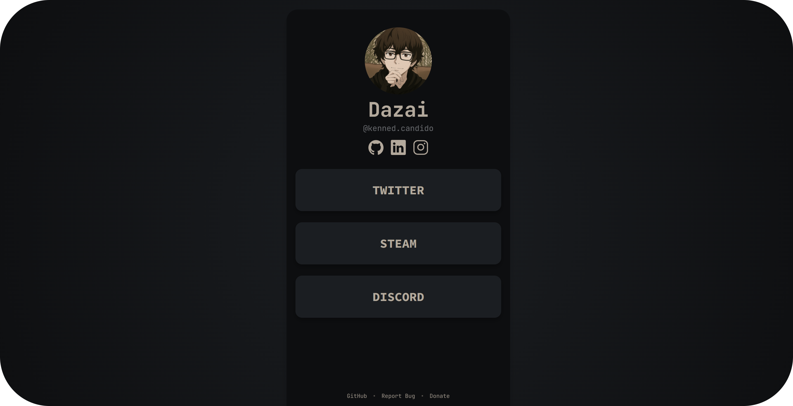

---

Linkzy is your simple, elegant, and fully customizable link-in-bio.

It’s **100% open source** and super easy to tweak in the code. Whether you’re just starting out or already experienced with programming, you can organize your links and customize the style your way.

With Linkzy, your links stay neatly organized, your profile is fast and responsive, and it works perfectly on any device — **your way, without complications.**

[**Documentation**]()

---

## Donate

If you enjoy using Linkzy and want to support the project, consider making a small donation. Every contribution helps keep development going and improves the project for everyone!

