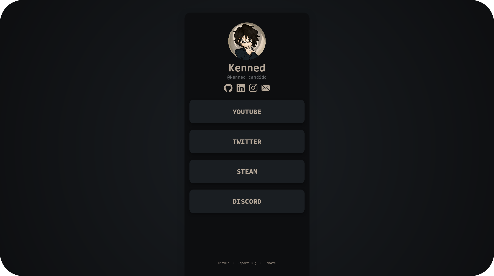

---

## What is Linkzy?

Linkzy is a simple, fast, and fully customizable link-in-bio — no frameworks, no dependencies, just plain HTML, CSS, and JavaScript.

It's **100% open source** and built to be easy to tweak, whether you're just starting out or already comfortable with code. Organize your links, customize your colors and fonts, and deploy it anywhere — your way, without complications.

---

## Features

- 🎨 Fully customizable theme via CSS variables
- 🖼️ Profile picture via GitHub avatar or local image
- 🔗 Add as many links as you want
- 💬 Social icon links with SVG support
- 📱 Responsive — works on any device
- ⚡ No frameworks, no build tools, no dependencies

---

## Getting Started

1. Fork or download this repository
2. Edit `index.html` with your name, username, and links
3. Edit `:root` in `assets/css/styles.css` to set your colors
4. Edit the config block in `assets/js/main.js` to set your profile picture
5. Deploy to GitHub Pages, Netlify, Vercel, or any static host

Full setup guide → [Wiki](https://github.com/kenned-candido/Linkzy/wiki)

---

## Branches

| Branch | Purpose |
|---|---|
| `main` | Clean template — ready to fork and customize |
| `pages` | Live demo — kenned.candido's own Linkzy |
| `developer` | Development branch — work in progress |

---

## Support the Project

If Linkzy was useful to you, consider supporting its development. Every contribution helps keep the project alive and improving for everyone.

